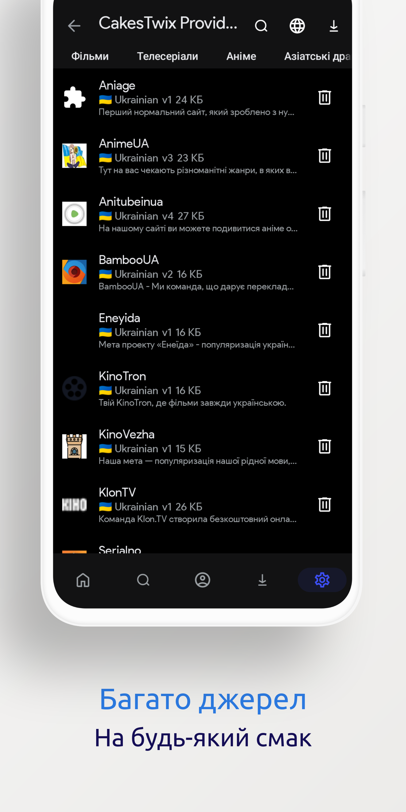

	<!-- Title -->
	 
	<b>🇺🇦 Розширення Cloudstream (Україна)</b>

| 

 | 

 | 

 | 

 |
|-----|--------|-----|--------|

<!-- Brief information about the extension -->
## 📖 Що це таке?
Це спеціальне розширення для перегляду фільмів, серіалів та аніме в якісному українському дубляжу від різних постачальників в стрімінговій програмі [Cloudstream](https://github.com/recloudstream/cloudstream).

<!-- Installation guide -->
## ⚙️ Інсталяція
Скопіюйте посилання нижче і перейдіть в Додаток -> Параметри -> Розширення -> Додати репозиторій

https://raw.githubusercontent.com/deleteBlack666/cloudstream-extensions-uk/master/repo.json

***
НЕ ПРАЦЮЄ 
***///
